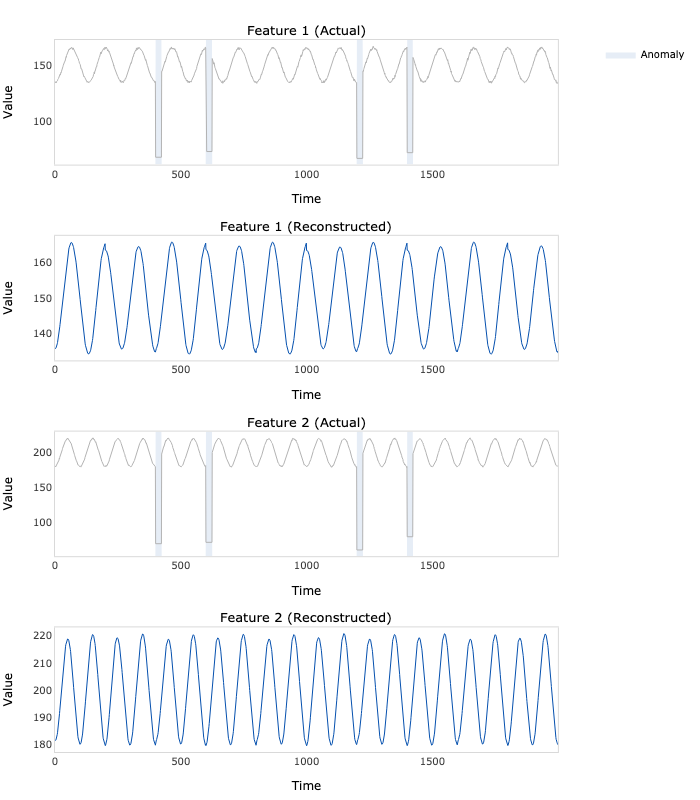

# EncDec-AD TensorFlow


TensorFlow implementation of multivariate time series anomaly detection model introduced in Malhotra, P., Ramakrishnan, A.,
Anand, G., Vig, L., Agarwal, P. and Shroff, G., 2016. LSTM-based encoder-decoder for multi-sensor anomaly detection.
[arXiv:1607.00148](https://arxiv.org/abs/1607.00148).

## Dependencies
```bash
pandas==1.4.3
numpy==1.23.1
tensorflow==2.9.1
plotly==5.9.0
kaleido==0.2.1
```
## Usage
```python
import numpy as np
from encdec_ad_tensorflow.model import EncDecAD

# Generate two time series
N = 2000
t = np.linspace(0, 1, N)
e = np.random.multivariate_normal(mean=np.zeros(2), cov=np.eye(2), size=N)
a = 100 + 10 * np.cos(2 * np.pi * (10 * t - 0.5)) + 0.5 * e[:, 0]
b = 200 + 20 * np.cos(2 * np.pi * (20 * t - 0.4)) + 1.0 * e[:, 1]
x = np.hstack([a.reshape(- 1, 1), b.reshape(- 1, 1)])


# Fit the model
model = EncDecAD(
    x=x,
    units=100,
    timesteps=200
)

model.fit(
    learning_rate=0.001,
    batch_size=32,
    epochs=400,
    verbose=True
)

# Add some anomalies
a = np.random.choice(a=[100 * p for p in range(1, N // 100 - 1)], replace=False, size=3)
b = np.random.randint(low=15, high=30, size=3)
for i in range(3):
    x[a[i]: a[i] + b[i], :] = np.random.randint(low=30, high=60, size=2)

# Score the anomalies
reconstructions, scores = model.predict(x=x)

# Plot the anomalies
fig = model.plot(quantile=0.95)
fig.write_image('anomalies.png', width=700, height=800)
```

