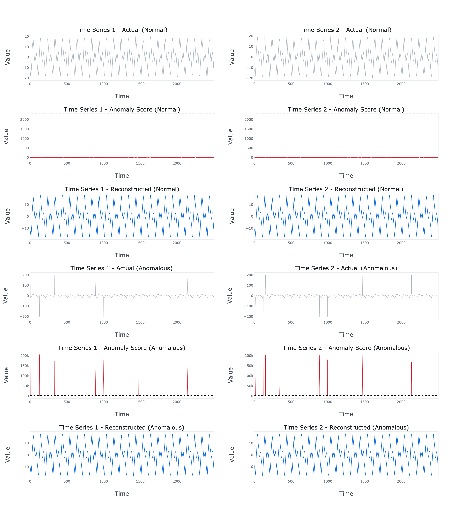

# EncDec-AD TensorFlow


TensorFlow implementation of multivariate time series anomaly detection model introduced in Malhotra, P., Ramakrishnan, A.,
Anand, G., Vig, L., Agarwal, P. and Shroff, G., 2016. LSTM-based encoder-decoder for multi-sensor anomaly detection.

## Dependencies
```bash
numpy==1.24.3
scikit-learn==1.2.2
tensorflow==2.13.0
plotly==5.15.0
kaleido==0.2.1
```
## Usage
```python
import numpy as np
from sklearn.metrics import accuracy_score, precision_score, recall_score, f1_score

from encdec_ad_tensorflow.model import EncDecAD
from encdec_ad_tensorflow.plots import plot

m = 2             # Number of time series.
N = 10000         # Length of each time series.
train_size = 0.5  # Fraction of observations to use for training.

# Generate the normal time series.
t = np.linspace(0, 1, N).reshape(-1, 1)
c = np.cos(2 * np.pi * (50 * t - 0.5))
s = np.sin(2 * np.pi * (100 * t - 0.5))
xn = 10 * c + 10 * s + np.random.normal(size=(N, m))

# Generate the anomalous time series.
xa = xn.copy()
ya = np.zeros(N)
for j in range(N):
    if np.random.uniform() > 0.997:
        xa[j, :] += np.random.randint(low=30, high=70, size=m)
        xa[j, :] *= np.random.choice([-1, 1], size=m)
        ya[j] = 1

# Split the time series.
xn_train, xn_test = xn[:int(train_size * len(xn))], xn[int(train_size * len(xn)):]
xa_train, xa_test = xa[:int(train_size * len(xa))], xa[int(train_size * len(xa)):]
ya_train, ya_test = ya[:int(train_size * len(ya))], ya[int(train_size * len(ya)):]

# Fit the model.
model = EncDecAD(
    m=m,          # Number of time series.
    L=200,        # Number of time steps.
    c=64,         # Number of hidden units.
    beta=1        # F-score beta.
)

model.fit(
    xn_train,
    xa_train,
    ya_train,
    learning_rate=0.0001,
    batch_size=32,
    max_epochs=100,
    early_stopping_start_epoch=10,
    early_stopping_patience=10,
    verbose=1
)

# Generate the model predictions (reconstructions, anomaly scores and anomaly labels).
rn_pred_test, an_pred_test, yn_pred_test = model.predict(xn_test)
ra_pred_test, aa_pred_test, ya_pred_test = model.predict(xa_test)

# Evaluate the results.
print('Accuracy: {:.6f}'.format(accuracy_score(ya_test, ya_pred_test)))
print('Precision: {:.6f}'.format(precision_score(ya_test, ya_pred_test)))
print('Recall: {:.6f}'.format(recall_score(ya_test, ya_pred_test)))
print('F1: {:.6f}'.format(f1_score(ya_test, ya_pred_test)))

# Plot the results.
fig = plot(xn=xn_test, xa=xa_test, rn=rn_pred_test, ra=ra_pred_test, an=an_pred_test, aa=aa_pred_test, tau=model.tau.numpy())
fig.write_image('results.png', scale=4, height=900, width=400 * m)
```

